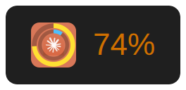

# Claude Usage Indicator — User Manual

Shows your Claude.ai weekly usage percentage in the GNOME or KDE Plasma panel and dock.

---

## What you see

**Top panel** (right side, next to Wi-Fi/battery):



The icon is the static Anthropic star logo. The percentage label is color-coded: green below the warning threshold · amber at or above it · red at or above the critical threshold (defaults: 70 / 90, applied to current pacing — see *Color semantics* under Configuration). On the *broken* tier the icon itself swaps to a red-tinted variant.

**Scroll** on the panel label to cycle the displayed metric through every eligible meter — Current session, All models, Sonnet only, Claude Design, the daily routine-run counter, Extra usage if active. The popup's `✴` marker tracks which one is currently in the panel. (Sonnet at 0 % is skipped so the panel doesn't show "0 %" for a meter the popup also hides.)

**Click** the panel label to open the popup:


The `✴` marks the metric shown in the panel label.

With extra usage enabled on your account, a second section appears:


**Dock icon** (once pinned — see Installation below):


- **Outer ring** — All models weekly usage (green → amber → red)
- **Inner ring** — Sonnet only weekly usage (blue by default); hidden entirely when Sonnet usage is 0%

**Hover** the dock icon to see a one-line summary tooltip:


Reset times show a countdown (`⏱h:mm`) when less than 12 h away, or a day + time otherwise. Sonnet is omitted from the tooltip when its usage is 0%.

The icon regenerates automatically on each data fetch.

### When something is wrong

The panel and dock icons change color when the data is suspect or Claude is having problems. Three tiers:

| State | Trigger | Panel icon | Dock icon | Popup status |
|-------|---------|------------|-----------|--------------|
| **Normal** | Fresh data, no errors | Anthropic orange + percentage colors | Orange tile · colored rings | normal meter list |
| **Stale** | No fresh data in 15 min (~2 missed fetches) | Ghosted, 40% opacity | Greyscale tile · grey rings | `🕐 No update in N min` |
| **Broken** | One of: <br/>· No fresh data in 20 min (~3 missed)<br/>· 2+ consecutive scrape failures (claude.ai returned an error, login expired, page changed)<br/>· Anthropic's status page (`status.claude.com`) reports an incident on the `claude.ai` component | Red-tinted | Orange tile · solid red rings | `⚠ <reason>` — names the cause |

The Chrome extension polls Anthropic's public status page on every cycle and surfaces the incident text (e.g. *"Anthropic reports: Minor Service Outage"*) in the popup so you don't need to alt-tab to find out whether it's your laptop or theirs.

Recovery is automatic: the next successful scrape resets the state and the icons return to their normal colors.

---

## Installation

**Requirements:** GNOME Shell 45–50 **or** KDE Plasma 6 + systemd-user + Google Chrome (logged in to Claude.ai). The Chrome extension and local server are identical on both desktops; only the panel frontend differs (GNOME Shell extension vs KDE plasmoid — see *KDE Plasma* below).

Minimum distro versions that ship GNOME Shell 45 or newer (KDE users need Plasma 6.0+):

| Distro | Minimum | Ships with |
|---|---|---|
| **Fedora** | 39 (Nov 2023) | GNOME 45 |
| **Ubuntu** | 23.10 — or **24.04 LTS** | GNOME 45 / 46 |
| **Debian** | 13 (Trixie, Aug 2025) | GNOME 48 |
| **RHEL** | 10 (2025) | GNOME 47 |
| **Arch · openSUSE Tumbleweed** | rolling | latest |

Older releases (Debian 12 Bookworm = GNOME 43, RHEL 9 = GNOME 40, Ubuntu 22.04 LTS = GNOME 42) ship too-old GNOME Shells for the extension to load. The Python server, systemd unit, and Chrome extension still install on those, but the panel indicator won't appear until the desktop is upgraded.

The three install paths below cover different distro reaches — pick whichever matches your system:

### Option A — Debian package (Debian/Ubuntu only)

Add the `apt.indri.studio` repository, then install via `apt`:

```bash
# 1. Trust the signing key
curl -fsSL https://apt.indri.studio/key.gpg \
  | sudo gpg --dearmor -o /etc/apt/keyrings/indri.gpg

# 2. Add the source
echo "deb [signed-by=/etc/apt/keyrings/indri.gpg] https://apt.indri.studio stable main" \
  | sudo tee /etc/apt/sources.list.d/indri.list

# 3. Install
sudo apt update && sudo apt install claude-usage
claude-usage-setup        # run as yourself, not root
```

`claude-usage-setup` creates your config file, enables the systemd service, enables the GNOME extension, and installs the dock entry — all in one step. (On KDE Plasma the package installs the plasmoid; add it to a panel yourself — see *KDE Plasma* below.)

### Option B — From a source tarball (any distro with apt / dnf / pacman)

Download the pinned source tarball from the apt.indri.studio mirror and run the install script in-tree:

```bash
# Pointer lists the current version + sha256
curl -fsSL https://apt.indri.studio/sources/claude-usage-latest.json
# Then download + extract + run the upstream install.sh
TARBALL=$(curl -fsSL https://apt.indri.studio/sources/claude-usage-latest.json | python3 -c 'import json,sys; print(json.load(sys.stdin)["tarball"])')
curl -fsSL "$TARBALL" | tar -xz
cd claude-usage-*
./install.sh
```

Nothing is compiled — `install.sh` is a wire-up script that copies JS + Python files into your XDG directories, compiles the gschema XML, and registers the systemd user service + dock launcher. Python deps (`python3-cairo`, `python3-pil`) install via apt/dnf/pacman automatically if missing.

### Option C — One-liner (any distro with apt / dnf / pacman)

```bash
curl -fsSL https://apt.indri.studio/install-claude-usage.sh | bash
```

Same wire-up as Option B, with no clone step. The bootstrap fetches the latest release tarball into a temp dir, then execs the upstream `install.sh`. Pass `--uninstall` through with `bash -s --`:

```bash
curl -fsSL https://apt.indri.studio/install-claude-usage.sh | bash -s -- --uninstall
```

> **Pick one install method.** Running the `.deb` and source/curl installs simultaneously creates a systemd unit conflict: `install.sh` registers a user-level `claude-usage-fetch.service` that takes precedence over the system-level unit from the `.deb`, so one service silently never runs. If switching methods, uninstall the old one first (see [Uninstall](#uninstall)).

### Both paths — complete setup

**Load the Chrome extension:**

1. Open `chrome://extensions`
2. Enable **Developer mode** (top-right toggle)
3. Click **Load unpacked** → select:
   - Clone install (Option B): `chrome-extension/` inside the repo
   - One-liner install (Option C): `~/.local/share/claude-usage/chrome-extension/`
   - .deb install (Option A): `/usr/share/claude-usage/chrome-extension/`

**Log out and back in** — activates the GNOME Shell extension. (KDE: instead add the widget to a panel — see *KDE Plasma* below.)

**Pin the dock icon (one-time):**

1. Press Super → search "Claude Usage"
2. Right-click → **Add to Favorites**

---

## After every login

Nothing to do. Everything starts automatically:

| Component | How it starts |
|-----------|--------------|
| Local data server | systemd user service (`claude-usage-fetch.service`) |
| Chrome extension | Persists in Chrome across restarts |
| GNOME panel indicator | Loaded by GNOME Shell from enabled-extensions list |
| KDE panel indicator | Loaded by Plasma once the widget is added to a panel |

---

## Day-to-day use

**Data updates every 7 minutes** — the Chrome extension scrapes `claude.ai/settings/usage` and writes `~/.cache/claude-usage/usage.json`. If you already have that page open in a tab, it reads from there; otherwise it opens a temporary background tab. The panel indicator updates immediately when the file changes.

**Force an immediate refresh** — two ways:

- **Click the Claude Usage Tracker icon in the Chrome toolbar.** Opens a fresh background tab, scrapes, closes the tab. Background to the user.
- **Open `claude.ai/settings/usage` in any normal tab** (via the popup's "Open Usage Page" item, a bookmark, the address bar, anything). The extension auto-scrapes the page once it finishes loading and stays out of your way — the tab isn't touched, it's just read. Debounced to one auto-scrape per 30 s so a page reload or a second tab doesn't double-fire.

**Check the raw data:**

```bash
cat ~/.cache/claude-usage/usage.json
cat ~/.cache/claude-usage/port      # which local port the server bound (7331-7340)
```

**Run the diagnostics tool:**

```bash
claude-usage-status
```

Reports service health, cache freshness, meter breakdown, and extension state in one command.

---

## KDE Plasma

On KDE Plasma 6 the indicator is a **plasmoid** (the `.deb` installs it to `/usr/share/plasma/plasmoids/org.indri.claude-usage/`; the Chrome extension and local server work exactly as on GNOME). To add it:

1. **Right-click a panel → Add Widgets…**, search **Claude Usage**, and click it. In a panel it shows the compact indicator — the bundled icon plus the selected meter's `%` in its pacing colour — and **click it to expand** the full breakdown (every meter with a bar + reset countdown, the data-age line, a panel-metric selector, and an "Open Usage Page" link). Scroll the panel indicator to cycle which meter the `%` tracks.
2. **Configure:** right-click the widget → **Configure Claude Usage…** — colours, warning/critical thresholds, popup font, and sizes. These persist in KConfig; colour/threshold/font choices are also mirrored to `~/.config/claude-usage/config.json` so the dock-launcher icon (`generate-icon.py`) picks them up.

> Add it to a **panel**, not the desktop. A panel gives the compact icon that expands on click; dropped on the desktop a plasmoid renders its *full* breakdown directly (Plasma shows the full representation for desktop widgets) — fine as a desktop widget, but not the compact indicator. Adding it to both at once (as the live test harness does, to exercise both representations) is why you'd see two breakdowns.

---

## Configuration

On **GNOME**, all settings are stored in GSettings (dconf). Open the preferences UI:

```bash
gnome-extensions prefs claude-usage@indri.studio
```

Changes to colors, thresholds, bar width, and font sizes apply instantly — no restart needed. (On **KDE**, configure via the widget's right-click **Configure Claude Usage…** dialog — see *KDE Plasma* above.)

You can also set any value from the command line:

```bash
gsettings set org.indri.claude-usage popup-color-normal '#0000ff'
gsettings set org.indri.claude-usage threshold-warning 60
gsettings reset org.indri.claude-usage popup-color-normal  # restore default
```

**Color semantics:** colors reflect your current *pacing*, not raw % used. The driver is `pct ÷ fraction-of-period-elapsed` — so 50% used halfway through a week is "on pace for 100%" and shows red, while 80% used near the end of a week is "on pace for ~90%" and shows amber. Per-meter period lengths are inferred over time from observed reset distances; until enough history accumulates, colors fall back to raw % used.

**All settings and defaults:**

| Setting | Default | Description |
|---------|---------|-------------|
| `weekly-color-green` | ${\color{#8cff8c}■}$ `#8cff8c` | Dock outer ring · below warning threshold |
| `weekly-color-amber` | ${\color{#ffe033}■}$ `#ffe033` | Dock outer ring · ≥ warning threshold |
| `weekly-color-red` | ${\color{#ff5933}■}$ `#ff5933` | Dock outer ring · ≥ critical threshold |
| `sonnet-color` | ${\color{#4dbfff}■}$ `#4dbfff` | Dock inner ring (hidden when Sonnet usage is 0%) |
| `popup-color-normal` | ${\color{#2a9a2a}■}$ `#2a9a2a` | Popup text · below warning threshold |
| `popup-color-warning` | ${\color{#d07000}■}$ `#d07000` | Popup text · ≥ warning threshold |
| `popup-color-critical` | ${\color{#e03030}■}$ `#e03030` | Popup text · ≥ critical threshold |
| `panel-color-normal` | ${\color{#ffffff}■}$ `#ffffff` | Panel label · below warning threshold |
| `panel-color-warning` | ${\color{#d07000}■}$ `#d07000` | Panel label · ≥ warning threshold |
| `panel-color-critical` | ${\color{#e03030}■}$ `#e03030` | Panel label · ≥ critical threshold |
| `threshold-warning` | `70` | Pacing % at which color flips to warning (see *Color semantics* below) |
| `threshold-critical` | `90` | Pacing % at which color flips to critical |
| `bar-width` | `10` | █░ bar character count in popup |
| `panel-font-size` | `11` | Panel label font size (px) |
| `panel-label-spacing` | `6` | Pixels between panel icon and label |
| `popup-font-size` | `10` | Popup meter row font size (px) |
| `popup-font-family` | `monospace` | Popup meter row font family |
| `panel-icon-size` | `16` | Panel icon pixel size |

> The four dock-ring colors (`weekly-color-*`, `sonnet-color`) also accept an 8-digit `#RRGGBBAA` value to make the ring translucent. The popup and panel-label colors are text and require the 6-digit `#RRGGBB` form.

---

## Troubleshooting

### Panel shows `--`
The cache file doesn't exist yet. Click the Chrome extension toolbar icon to trigger a fetch.

### Panel shows stale data ("Xm ago" is large) or ⚠ in the popup
The Chrome extension may not be running. Open Chrome → `chrome://extensions` → confirm Claude Usage Tracker is enabled. Click its toolbar icon to force a fetch.

> **Reset times** are displayed in your system timezone. Claude.ai returns times in the browser's timezone, which your desktop controls. They will agree unless you have manually overridden the browser timezone.

### Server not running
```bash
systemctl --user status claude-usage-fetch.service
systemctl --user restart claude-usage-fetch.service
```

### Chrome extension errors
`chrome://extensions` → Claude Usage Tracker → **Errors**. Clear them, then click the toolbar icon to retry.

### Panel indicator missing after login
**GNOME:**
```bash
gnome-extensions list --enabled | grep claude-usage
# If not listed:
gnome-extensions enable claude-usage@indri.studio
```
**KDE:** right-click a panel → **Add Widgets…** → search **Claude Usage**. If it's not listed, confirm the plasmoid is installed (`ls ~/.local/share/plasma/plasmoids/org.indri.claude-usage` or `/usr/share/plasma/plasmoids/org.indri.claude-usage`) and restart Plasma (`kquitapp6 plasmashell && kstart6 plasmashell`).

### Dock icon not updating after changing colors
Force a data fetch (Chrome toolbar icon) or re-run the icon generator directly:

```bash
# Source install:
python3 ~/.local/share/claude-usage/generate-icon.py
# .deb install:
python3 /usr/share/claude-usage/generate-icon.py
```

### Check or reset a setting

```bash
gsettings get org.indri.claude-usage popup-color-normal
gsettings reset org.indri.claude-usage popup-color-normal
gsettings reset-recursively org.indri.claude-usage  # restore all defaults
```

---

## Publishing the Chrome extension

The extension currently requires loading unpacked. To publish to the Chrome Web Store:

1. Register at [chrome.google.com/webstore/devconsole](https://chrome.google.com/webstore/devconsole) ($5 one-time developer fee)
2. Build the submission zip: `task build-chrome-zip` → produces `dist/claude-usage-chrome-{VERSION}.zip`
3. Upload the zip in the developer console

---

## Repo layout

```
claude-usage/
  chrome-extension/   Chrome extension (load via chrome://extensions → Load unpacked)
  desktop/gnome/      GNOME Shell 45–50 panel + dock indicator (extension)
  desktop/kde/        KDE Plasma 6 panel + popup indicator (plasmoid)
  desktop/launcher/   Dock launcher entry template (.desktop)
  server/             Local HTTP server + dock icon generator
  systemd/            User service definition
  packaging/          .deb and Chrome Web Store build scripts
  scripts/            Build + maintenance utilities. Includes one
                      render-*.py per docs/*.png so screenshots are
                      regenerable from source, not hand-captured.
  install.sh          Source install; run once per machine
  PRIVACY.md          Chrome Web Store privacy policy
  MANUAL.md           This file
```

To regenerate any documentation image, run its dedicated script — e.g.
`python3 scripts/render-popup-screenshot.py` for `docs/popup-screenshot.png`.
Each script builds a synthetic state and pipes through headless Chrome (or
Cairo, for the dock icon) so the image matches what the live code produces
at those values. When extension.js or generate-icon.py changes rendering,
re-run every `render-*.py` and commit the refreshed PNGs.

---

## Uninstall

**Source install:**

```bash
./install.sh --uninstall
```

**.deb install:**

```bash
sudo apt remove claude-usage
```

`postrm` runs as root, so it only cleans system files under `/usr/share/`. Per-user state from `claude-usage-setup` is left behind — remove it manually for a full wipe:

```bash
rm -f  ~/.local/share/applications/claude-usage.desktop
rm -f  ~/.local/share/icons/hicolor/*/apps/claude-usage.png
rm -f  ~/.local/share/icons/hicolor/icon-theme.cache
rm -rf ~/.cache/claude-usage
```

(The icon is emitted at five hicolor sizes — 48, 64, 96, 128, 256 — so XDG icon-theme lookup always finds a live ring-painted version. The glob clears all of them.)

(The `org.gnome.shell.enabled-extensions` dconf entry is harmless once the extension files are gone — GNOME Shell silently ignores unknown UUIDs.)

Both: open `chrome://extensions`, remove Claude Usage Tracker, and log out.
