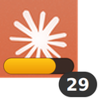

# Claude Usage Indicator — User Manual

Shows your Claude.ai weekly usage percentage in the GNOME top panel and dock.

---

## What you see

**Top panel** (right side, next to Wi-Fi/battery):

```
  ✳ 74%
```

The ✳ is the Anthropic star logo icon. Color-coded: green < 50 % · amber 50–79 % · red ≥ 80 %

**Click** the panel label to open the popup:

```
Max plan · 2m ago
────────────────────────────────────────────────
Current session     29%  ███░░░░░░░  Resets in 3 hr 3 min
All models          74%  ████████░░  Resets Tue 12:59 PM
Sonnet only          4%  ░░░░░░░░░░  Resets Tue 12:59 PM
Claude Design       51%  █████░░░░░  Resets Tue 1:00 PM
────────────────────────────────────────────────
Open Usage Page
```

**Dock icon** (once pinned — right-click → Add to Favorites):



The amber bar at the bottom fills proportionally to your "All models" weekly usage.
The badge shows your current session usage.

---

## After first reboot

Two one-time steps. After that, everything is automatic.

**Step 1 — Enable the GNOME extension** (terminal):

```bash
gnome-extensions enable claude-usage@wbnorris.gmail.com
```

The panel indicator appears immediately. This only needs to be done once — the setting persists across all future logins.

**Step 2 — Pin the dock icon** (one-time):

1. Press the Super key → search "Claude Usage"
2. Right-click the icon → **Add to Favorites**

The dock icon shows the progress ring and badge on every login from then on.

---

## After every subsequent reboot

Nothing. Everything starts automatically:

| Component | How it starts |
|-----------|--------------|
| Local data server | systemd user service (`claude-usage-fetch.service`) |
| Chrome extension | Persists in Chrome across restarts |
| GNOME panel indicator | Loaded by GNOME Shell from enabled-extensions list |

---

## Day-to-day use

**Data updates every 15 minutes** — the Chrome extension opens `claude.ai/settings/usage` in a background tab, scrapes the meters, and writes `~/.cache/claude-usage.json`. The panel indicator updates immediately when the file changes.

**Force an immediate refresh:** click the Claude Usage Tracker icon in the Chrome toolbar.

**Check the raw data:**

```bash
cat ~/.cache/claude-usage.json
```

---

## Troubleshooting

### Panel shows `--`
The cache file doesn't exist yet. Click the Chrome extension toolbar icon to trigger a fetch.

### Panel shows stale data ("Xm ago" is large)
The Chrome extension may not be running. Open Chrome and check `chrome://extensions` — the Claude Usage Tracker should be enabled. Click its toolbar icon to force a fetch.

### Server not running
```bash
systemctl --user status claude-usage-fetch.service
systemctl --user restart claude-usage-fetch.service
```

### Chrome extension errors
Open `chrome://extensions` → Claude Usage Tracker → **Errors**. Clear them, then click the toolbar icon to retry.

### Panel indicator missing after relog
```bash
gnome-extensions list --enabled | grep claude-usage
# If not listed:
gnome-extensions enable claude-usage@wbnorris.gmail.com
```

---

## Repo layout

```
claude-usage/
  chrome-extension/   Chrome extension (load via chrome://extensions → Load unpacked)
  gnome-extension/    GNOME Shell 45–49 panel + dock indicator
  server/             Local HTTP server (receives data from Chrome extension)
  systemd/            User service definition
  desktop/            Dock launcher entry template
  install.sh          Installs everything; run once per machine
  MANUAL.md           This file
```

---

## Uninstall

```bash
./install.sh --uninstall
```

Then open `chrome://extensions` and remove Claude Usage Tracker. Log out and back in to clear the panel indicator.
