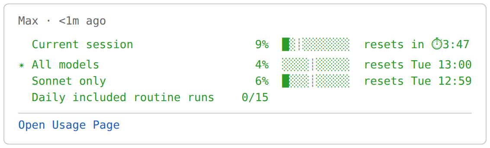
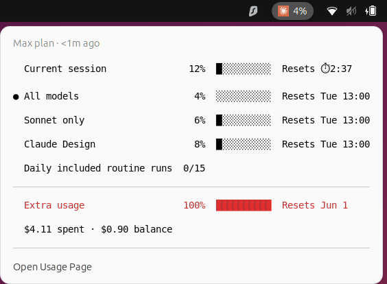
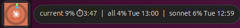

# Claude Usage Indicator — User Manual

Shows your Claude.ai weekly usage percentage in the GNOME top panel and dock.

---

## What you see

**Top panel** (right side, next to Wi-Fi/battery):

```
  ✳ 74%
```

The ✳ is the Anthropic star logo icon. Color-coded: green below the warning threshold · amber at or above it · red at or above the critical threshold (defaults: 70 / 90, applied to current pacing — see *Color semantics* under Configuration).

**Scroll** on the panel label to toggle between **All models** and **Sonnet only**.

**Click** the panel label to open the popup:



The `✴` marks the metric shown in the panel label.

With extra usage enabled on your account, a second section appears:



**Dock icon** (once pinned — see Installation below):


- **Outer ring** — All models weekly usage (green → amber → red)
- **Inner ring** — Sonnet only weekly usage (blue by default); hidden entirely when Sonnet usage is 0%

**Hover** the dock icon to see a one-line summary tooltip:



Reset times show a countdown (`⏱h:mm`) when less than 24 h away, or a day + time otherwise. Sonnet is omitted from the tooltip when its usage is 0%.

The icon regenerates automatically on each data fetch.

### When something is wrong

The panel and dock icons change color when the data is suspect or Claude is having problems. Three tiers:

| State | Trigger | Panel icon | Dock icon | Popup status |
|-------|---------|------------|-----------|--------------|
| **Normal** | Fresh data, no errors | Anthropic orange + percentage colors | Orange tile · colored rings | normal meter list |
| **Stale** | No fresh data in 10 min (~1.5 missed fetches) | Ghosted, 40% opacity | Greyscale tile · grey rings | `🕐 No update in N min` |
| **Broken** | One of: <br/>· No fresh data in 20 min (~3 missed)<br/>· 2+ consecutive scrape failures (claude.ai returned an error, login expired, page changed)<br/>· Anthropic's status page (`status.claude.com`) reports an incident on the `claude.ai` component | Red-tinted | Orange tile · solid red rings | `⚠ <reason>` — names the cause |

The Chrome extension polls Anthropic's public status page on every cycle and surfaces the incident text (e.g. *"Anthropic reports: Minor Service Outage"*) in the popup so you don't need to alt-tab to find out whether it's your laptop or theirs.

Recovery is automatic: the next successful scrape resets the state and the icons return to their normal colors.

---

## Installation

**Requirements:** Ubuntu 22.04+ · GNOME Shell 45–49 · Google Chrome (logged in to Claude.ai)

### Option A — Debian package

Download the latest `.deb` from the [GitHub releases page](https://github.com/wbniv/claude-usage/releases/latest), then:

```bash
sudo dpkg -i claude-usage_*.deb
sudo apt-get install -f   # resolves any missing deps
claude-usage-setup        # run as yourself, not root
```

`claude-usage-setup` creates your config file, enables the systemd service, enables the GNOME extension, and installs the dock entry — all in one step.

### Option B — From source

```bash
git clone https://github.com/wbniv/claude-usage.git
cd claude-usage
./install.sh
```

`install.sh` installs Python deps (`python3-cairo`, `python3-pil`) via apt automatically if missing.

> **Pick one install method.** Running the `.deb` and source installs simultaneously creates a systemd unit conflict: `install.sh` registers a user-level `claude-usage-fetch.service` that takes precedence over the system-level unit from the `.deb`, so one service silently never runs. If switching methods, uninstall the old one first (see [Uninstall](#uninstall)).

### Both paths — complete setup

**Load the Chrome extension:**

1. Open `chrome://extensions`
2. Enable **Developer mode** (top-right toggle)
3. Click **Load unpacked** → select:
   - Source install: `chrome-extension/` inside the repo
   - .deb install: `/usr/share/claude-usage/chrome-extension/`

**Log out and back in** — activates the GNOME Shell extension.

**Pin the dock icon (one-time):**

1. Press Super → search "Claude Usage"
2. Right-click → **Add to Favorites**

---

## After every login

Nothing to do. Everything starts automatically:

| Component | How it starts |
|-----------|--------------|
| Local data server | systemd user service (`claude-usage-fetch.service`) |
| Chrome extension | Persists in Chrome across restarts |
| GNOME panel indicator | Loaded by GNOME Shell from enabled-extensions list |

---

## Day-to-day use

**Data updates every 7 minutes** — the Chrome extension opens `claude.ai/settings/usage` in a background tab, scrapes the meters, and writes `~/.cache/claude-usage/usage.json`. The panel indicator updates immediately when the file changes.

**Force an immediate refresh** — two ways:

- **Click the Claude Usage Tracker icon in the Chrome toolbar.** Opens a fresh background tab, scrapes, closes the tab. Background to the user.
- **Open `claude.ai/settings/usage` in any normal tab** (via the popup's "Open Usage Page" item, a bookmark, the address bar, anything). The extension auto-scrapes the page once it finishes loading and stays out of your way — the tab isn't touched, it's just read. Debounced to one auto-scrape per 30 s so a page reload or a second tab doesn't double-fire.

**Check the raw data:**

```bash
cat ~/.cache/claude-usage/usage.json
```

**Run the diagnostics tool:**

```bash
claude-usage-status
```

Reports service health, cache freshness, meter breakdown, and extension state in one command.

---

## Configuration

All settings are stored in GSettings (dconf). Open the preferences UI:

```bash
gnome-extensions prefs claude-usage@indri.studio
```

Changes to colors, thresholds, bar width, and font sizes apply instantly — no restart needed.

You can also set any value from the command line:

```bash
gsettings set org.gnome.shell.extensions.claude-usage popup-color-normal '#0000ff'
gsettings set org.gnome.shell.extensions.claude-usage threshold-warning 60
gsettings reset org.gnome.shell.extensions.claude-usage popup-color-normal  # restore default
```

**Color semantics:** colors reflect your current *pacing*, not raw % used. The driver is `pct ÷ fraction-of-period-elapsed` — so 50% used halfway through a week is "on pace for 100%" and shows red, while 80% used near the end of a week is "on pace for ~90%" and shows amber. Per-meter period lengths are inferred over time from observed reset distances; until enough history accumulates, colors fall back to raw % used.

**All settings and defaults:**

| Setting | Default | Description |
|---------|---------|-------------|
| `weekly-color-green` | ${\color{#8cff8c}■}$ `#8cff8c` | Dock outer ring · below warning threshold |
| `weekly-color-amber` | ${\color{#ffe033}■}$ `#ffe033` | Dock outer ring · ≥ warning threshold |
| `weekly-color-red` | ${\color{#ff5933}■}$ `#ff5933` | Dock outer ring · ≥ critical threshold |
| `sonnet-color` | ${\color{#4dbfff}■}$ `#4dbfff` | Dock inner ring (hidden when Sonnet usage is 0%) |
| `popup-color-normal` | ${\color{#2a9a2a}■}$ `#2a9a2a` | Popup text · below warning threshold |
| `popup-color-warning` | ${\color{#d07000}■}$ `#d07000` | Popup text · ≥ warning threshold |
| `popup-color-critical` | ${\color{#e03030}■}$ `#e03030` | Popup text · ≥ critical threshold |
| `panel-color-normal` | ${\color{#ffffff}■}$ `#ffffff` | Panel label · below warning threshold |
| `panel-color-warning` | ${\color{#d07000}■}$ `#d07000` | Panel label · ≥ warning threshold |
| `panel-color-critical` | ${\color{#e03030}■}$ `#e03030` | Panel label · ≥ critical threshold |
| `threshold-warning` | `70` | Pacing % at which color flips to warning (see *Color semantics* below) |
| `threshold-critical` | `90` | Pacing % at which color flips to critical |
| `bar-width` | `10` | █░ bar character count in popup |
| `panel-font-size` | `11` | Panel label font size (px) |
| `panel-label-spacing` | `6` | Pixels between panel icon and label |
| `popup-font-size` | `10` | Popup meter row font size (px) |
| `popup-font-family` | `monospace` | Popup meter row font family |
| `panel-icon-size` | `16` | Panel icon pixel size |

---

## Troubleshooting

### Panel shows `--`
The cache file doesn't exist yet. Click the Chrome extension toolbar icon to trigger a fetch.

### Panel shows stale data ("Xm ago" is large) or ⚠ in the popup
The Chrome extension may not be running. Open Chrome → `chrome://extensions` → confirm Claude Usage Tracker is enabled. Click its toolbar icon to force a fetch.

> **Reset times** are displayed in your system timezone. Claude.ai returns times in the browser's timezone, which GNOME controls. They will agree unless you have manually overridden the browser timezone.

### Server not running
```bash
systemctl --user status claude-usage-fetch.service
systemctl --user restart claude-usage-fetch.service
```

### Chrome extension errors
`chrome://extensions` → Claude Usage Tracker → **Errors**. Clear them, then click the toolbar icon to retry.

### Panel indicator missing after login
```bash
gnome-extensions list --enabled | grep claude-usage
# If not listed:
gnome-extensions enable claude-usage@indri.studio
```

### Dock icon not updating after changing colors
Force a data fetch (Chrome toolbar icon) or re-run the icon generator directly:

```bash
# Source install:
python3 ~/.local/share/claude-usage/generate-icon.py
# .deb install:
python3 /usr/share/claude-usage/generate-icon.py
```

### Check or reset a setting

```bash
gsettings get org.gnome.shell.extensions.claude-usage popup-color-normal
gsettings reset org.gnome.shell.extensions.claude-usage popup-color-normal
gsettings reset-recursively org.gnome.shell.extensions.claude-usage  # restore all defaults
```

---

## Publishing the Chrome extension

The extension currently requires loading unpacked. To publish to the Chrome Web Store:

1. Register at [chrome.google.com/webstore/devconsole](https://chrome.google.com/webstore/devconsole) ($5 one-time developer fee)
2. Build the submission zip: `task build-chrome-zip` → produces `dist/claude-usage-chrome-{VERSION}.zip`
3. Upload the zip in the developer console

---

## Repo layout

```
claude-usage/
  chrome-extension/   Chrome extension (load via chrome://extensions → Load unpacked)
  gnome-extension/    GNOME Shell 45–49 panel + dock indicator
  server/             Local HTTP server + dock icon generator
  systemd/            User service definition
  desktop/            Dock launcher entry template
  packaging/          .deb and Chrome Web Store build scripts
  install.sh          Source install; run once per machine
  PRIVACY.md          Chrome Web Store privacy policy
  MANUAL.md           This file
```

---

## Uninstall

**Source install:**

```bash
./install.sh --uninstall
```

**.deb install:**

```bash
sudo apt remove claude-usage
```

`postrm` runs as root, so it only cleans system files under `/usr/share/`. Per-user state from `claude-usage-setup` is left behind — remove it manually for a full wipe:

```bash
rm -f  ~/.local/share/applications/claude-usage.desktop
rm -rf ~/.cache/claude-usage
```

(The `org.gnome.shell.enabled-extensions` dconf entry is harmless once the extension files are gone — GNOME Shell silently ignores unknown UUIDs.)

Both: open `chrome://extensions`, remove Claude Usage Tracker, and log out.
