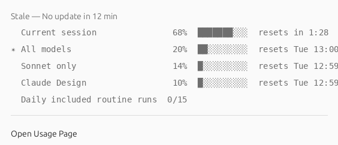
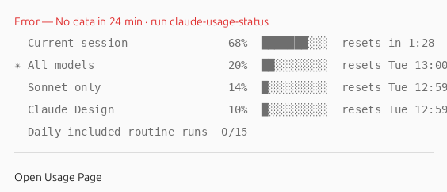
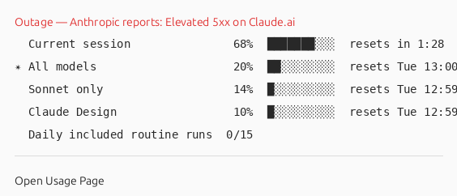

# Faster Stale Detection + Outage Awareness for Panel/Dock Icons

**Date:** 2026-05-17
**Status:** Planned

## Context

Today the GNOME extension's only "something is wrong" signal is a `⚠` glyph in the panel label that appears when the cache `_timestamp` is older than 30 min. There are three problems with this:

1. **30 min is too long to wait** for a soft signal — the user wants to know within a glance window that data is going stale.
2. **The signal is a small glyph**, easy to miss. A whole-icon color change (panel icon and dock icon) is a much stronger at-a-glance "something is off".
3. **It only catches the passive failure path** (no fresh POSTs landing). It misses *active* failures the Chrome extension could detect directly (claude.ai returning 5xx, login expired, page structure changed) and outage-confirmation signals (Anthropic's status page reporting an incident).

The desired outcome: a tiered, fast, visible signal that distinguishes "probably transient, here's a hint" from "this is definitely broken — and here's why."

## Design

Three new failure signals, ranked by confidence. The icon reflects the highest-confidence signal currently active:

| Tier | Trigger | Visual | Source | Panel | Dock |
|------|---------|--------|--------|-------|------|
| **Normal** | Fresh data, no errors | Existing percentage-based colors | Current logic |  |  |
| **Stale (soft)** | `_timestamp > 10 min` old | Ghosted grey panel icon · grey dock tile + rings | `extension.js` time check |  |  |
| **Broken — local** | `_timestamp > 20 min` old, OR scrape returned no meters / 5xx for 2 consecutive attempts | Red tint panel icon · red dock rings · popup explains | `extension.js` time check + `background.js` scrape-failure flag in cache |  |  |
| **Broken — confirmed outage** | status.claude.com reports `status.indicator !== "none"` OR the `claude.ai` component is non-operational | Same red as local; popup quotes the Anthropic incident summary | `background.js` polls `https://status.claude.com/api/v2/summary.json` |  |  |

> Mockups rendered by [`screenshots/2026-05-17-tiers/render-mockups.py`](screenshots/2026-05-17-tiers/render-mockups.py) using `server/generate-icon.py`'s production renderer with per-tier color overrides — so the dock images are pixel-faithful to what production will produce once `--tier {normal,stale,broken}` lands. Panel mockups are PIL composites of `gnome-extension/icons/claude-22.png` (4× scale): stale = 40% alpha (mimics `St.Icon.opacity = 100`); broken = red channel multiply. Live data at render time: All = 20%, Sonnet = 14%.

**Popup mockups** (PIL composites; ~564 px wide, matches the layout of `docs/popup-screenshot.png`). The only diff from the normal popup is the status row at the top — meter rows below show last-known data, greyed out when stale/local-broken to signal the data itself is suspect.

**Stale (soft):**


**Broken — local:**


**Broken — confirmed outage** (data may still be fresh; the status line surfaces Anthropic's incident text and the meter rows stay in normal color):


Polling change: **7 min** (was 15). That makes the 10-min stale threshold = ~1.5 missed fetches (soft, occasionally flickers on a slow page load — acceptable for the soft tier) and 20-min broken = ~3 missed (strong).

Status-page poll is piggy-backed on the same 7-min alarm so there's no second timer to manage; one extra HTTP call per cycle to a JSON endpoint that doesn't burn tokens.

## Files to change

### 1. `chrome-extension/manifest.json`

- Change `"version": "0.9.10"` → `"0.9.11"`.
- Add `"https://status.claude.com/*"` to `host_permissions`.

### 2. `chrome-extension/background.js`

- Alarm period: `15` → `7` minutes.
- After the existing scrape POST, fire a second `fetch('https://status.claude.com/api/v2/summary.json')`. Both results go into the POST body to the local server.
- Track scrape-failure state: if the scrape returns 0 meters OR throws OR the page content matches known error markers (`document.title` contains `5\d\d` / "Server Error" / "Application error"), increment a module-level `_scrapeFailCount`. Reset to 0 on success. POST current count to the server so it persists across service-worker restarts via the cache file.

The POST body grows from:
```json
{ "meters": [...], "plan": "Pro", "_timestamp": <epoch> }
```
to:
```json
{
  "meters": [...], "plan": "Pro", "_timestamp": <epoch>,
  "_scrape_fail_count": 0,
  "_anthropic_status": {
    "indicator": "none",
    "description": "All Systems Operational",
    "claude_ai_component_status": "operational"
  }
}
```

### 3. `server/usage-server.py`

Extend `_validate()` to accept the two new optional fields:
- `_scrape_fail_count`: int ≥ 0, bounded (≤ 1000)
- `_anthropic_status`: object with three known string fields, each bounded by `_bounded_str` (reuses the helper added in 0.9.6)

All other validation unchanged. Persisted in the cache as-is.

### 4. `gnome-extension/extension.js`

New state computation at the top of `_updateDisplay()`:

```javascript
const tier = computeTier(d);   // 'normal' | 'stale' | 'broken'
const reason = tierReason(d);  // human string for popup
```

Where `computeTier` checks, in order:
1. `_anthropic_status.indicator !== 'none'` OR `claude_ai_component_status !== 'operational'` → `broken`
2. `_scrape_fail_count >= 2` → `broken`
3. age > 20 min → `broken`
4. age > 10 min → `stale`
5. else → `normal`

Apply per-tier visuals:
- **Normal:** existing code path, untouched.
- **Stale:** set `this._icon.opacity = 100` (~40%, ghosted) AND set panel-label color to `#888`. Spawn `generate-icon.py --tier stale` so the dock icon also greys out. Show `🕐 No update in N min` as the popup status item.
- **Broken:** swap `this._icon.gicon` to a pre-rendered `claude-22-red.png` (full opacity, red-tinted). Spawn `generate-icon.py --tier broken`. Popup status item shows the reason — e.g. `⚠ Anthropic reports: Elevated error rates on Claude.ai` or `⚠ 4 scrape attempts failed` or `⚠ No data in 24 min`.
- On tier transitions, fire `Main.notify` (one-shot, keyed off `_lastTier` instead of the existing `_wasStale` so we don't double-notify on tier promotions).

The existing `⚠` glyph in the panel label becomes redundant once the icon itself is red — drop it from the label, keep it as a popup-status-item prefix.

### 5. `server/generate-icon.py`

Add `--tier {normal,stale,broken}` flag:
- `normal` (default): current behaviour.
- `stale`: render rings in the existing ring colors but desaturated to ~40% saturation; baseline logo also desaturated.
- `broken`: render rings in solid red (`#e03030`, the existing `weekly-color-red`); baseline logo unchanged so the brand is still recognisable.

Output filename unchanged (timestamped under `~/.cache/claude-usage/claude-usage-icon-{ns}.png`); the `.desktop` `Icon=` field already gets rewritten on every regen, so no extra plumbing.

### 6. Pre-rendered panel icon

Bake one extra raster at extension-build time: `gnome-extension/icons/claude-22-red.png`. Source from the existing `claude-22.png` with a `tint(#e03030, 0.7)` operation via PIL. Add the build step to `Taskfile.yml` (or just commit the rendered PNG and call it done — it's a one-off asset).

No "grey" panel asset needed — `St.Icon.opacity = 100` on the existing PNG is the grey state.

### 7. `MANUAL.md`

Add a "What you see when something is wrong" subsection under "What you see", documenting the three tiers, the visual cues, and the popup text formats.

Update the existing "Data updates every 15 minutes" line → "every 7 minutes".

### 8. `packaging/control`

Version bump 0.9.10 → 0.9.11.

## Design choices (and why)

- **Time-based broken at 20 min remains a fallback**, not the primary broken signal. The two new active signals (scrape-fail and status-page) catch real failures within ~7-14 min. The 20-min time fallback covers cases where the scrape isn't running at all (Chrome closed, service worker dead).
- **Content-based scrape failure detection (not `webRequest`).** Avoids adding a new permission, which would surface as a Chrome Web Store re-review. Page-content markers ("Server Error", "5xx", missing meter container) catch the common 5xx and login-expired cases.
- **Status-page poll piggy-backs on the existing alarm.** One timer to reason about. The status-page lag (Anthropic SRE updates manually, minutes-to-hours after a real incident) is fine: scrape-failure detection catches it sooner; status page provides authoritative confirmation when it lands.
- **One reason field per tier, surfaced in popup.** When the user sees red, they shouldn't have to run `claude-usage-status` to know whether it's "Anthropic outage" vs "login expired" vs "scrape page changed". The popup text answers that in one line.
- **Hardcoded colors for now, GSettings later.** Don't add `stale-color`/`broken-color` keys yet — ship with sensible defaults (grey desaturation; `#e03030` red). If users ask, add the keys.
- **Soft signal accepts flickers.** At 10-min stale + 7-min polling, a single slow fetch can briefly trip grey before the next poll clears it. That's fine because the visual is desaturation, not an alarm color. Red requires sustained failure or active confirmation.

## Critical files

- `chrome-extension/background.js` — alarm interval, scrape failure tracking, status-page poll.
- `chrome-extension/manifest.json` — `host_permissions` + version.
- `server/usage-server.py` — extend `_validate()`, reuse `_bounded_str` from 0.9.6.
- `gnome-extension/extension.js` — tier computation, icon state, popup reason text.
- `server/generate-icon.py` — `--tier` flag.
- `gnome-extension/icons/claude-22-red.png` — new asset.
- `MANUAL.md` — new subsection + interval update.
- `packaging/control`, `chrome-extension/manifest.json` — 0.9.10 → 0.9.11.

## Verification

1. **Server validator round-trip with new fields:**
    ```bash
    curl -X POST -H 'Content-Type: application/json' \
      -d '{"meters":[{"pct":0}],"_scrape_fail_count":3,"_anthropic_status":{"indicator":"major","description":"Elevated error rates","claude_ai_component_status":"degraded_performance"}}' \
      http://127.0.0.1:7332/usage
    ```
    Expect 200. Inspect `/tmp/usage-test-cache.json` to confirm round-trip.
    (Use the same scratch-port pattern as the 0.9.6 length-cap fix — do not stomp the live `:7331` server.)

2. **Validator rejects malformed new fields:**
    ```bash
    # negative scrape count
    curl -X POST … -d '{"meters":[],"_scrape_fail_count":-1}' …      # expect 422
    # non-string component status
    curl -X POST … -d '{"meters":[],"_anthropic_status":{"claude_ai_component_status":42}}' …  # expect 422
    ```

3. **status.claude.com fetch works from the Chrome extension context:** load the extension unpacked in Chrome, open the service-worker DevTools console, and run:
    ```javascript
    fetch('https://status.claude.com/api/v2/summary.json').then(r => r.json()).then(j => console.log(j.status));
    ```
    Expect `{indicator: "none", description: "All Systems Operational"}` (or current state). If CORS errors, the `host_permissions` entry isn't loaded — recheck manifest.

4. **Tier transitions render correctly without a real outage:**
   Forge a cache file with each tier's state and reload the extension:
    ```bash
    # stale
    python3 -c "import json,time; json.dump({'meters':[{'pct':10,'label':'5h'}],'plan':'Pro','_timestamp':int(time.time())-700}, open('/tmp/forge.json','w'))"
    cp /tmp/forge.json ~/.cache/claude-usage/usage.json
    # broken (anthropic confirmed)
    python3 -c "import json,time; json.dump({'meters':[{'pct':10,'label':'5h'}],'plan':'Pro','_timestamp':int(time.time()),'_anthropic_status':{'indicator':'major','description':'Elevated 5xx on Claude.ai','claude_ai_component_status':'major_outage'}}, open('/tmp/forge.json','w'))"
    cp /tmp/forge.json ~/.cache/claude-usage/usage.json
    ```
    Per memory `feedback_popup_preview_render.md`: render PIL mockups of each tier using live GSettings rather than logging out to reload the extension. Verify the dock icon by running `python3 server/generate-icon.py --tier stale` and `--tier broken` against the forged cache and inspecting the produced PNG with `xdg-open`.

5. **Polling change live:** in the Chrome service-worker console, `chrome.alarms.getAll(console.log)`. Confirm `periodInMinutes: 7`.

6. **Docs accuracy:**
    ```bash
    grep -n '15 minutes\|15 min\|every 15' MANUAL.md README.md PRIVACY.md
    ```
    Expect no hits after the update.

7. **Version lockstep:**
    ```bash
    grep -H Version packaging/control && grep -H '"version"' chrome-extension/manifest.json
    ```
    Both at 0.9.11.

Document raw output under each numbered step after running.

---

## Verification Results — 2026-05-17

> **Note on version numbers**: while implementation was in progress the manifest + control file drifted to 0.10.3 (external bumps between turns). Implemented version is **0.10.3 → 0.10.4**, not the 0.9.10 → 0.9.11 the plan originally named.
>
> **Note on test setup**: the user's live `.deb`-installed server is on `127.0.0.1:7331`. Verification spun up a scratch copy on `:7332` writing to `/tmp/usage-test-cache.json` (same approach as the 0.9.6 length-cap fix) so the live cache and dock icon are never disturbed.

### Step 1 — Syntax / lint

```
usage-server.py: OK
generate-icon.py: OK
extension.js: OK
background.js: OK
```

PASS.

### Step 2 — Server validator round-trip with new fields

```
-- 2a: full body (success POST) --
http=200
{
  "meters": [{"pct": 42, "label": "All models", "reset": "Resets Tue 1:00 PM"}],
  "plan": "Pro",
  "_scrape_fail_count": 0,
  "_anthropic_status": {
    "indicator": "none",
    "description": "All Systems Operational",
    "claude_ai_component_status": "operational"
  },
  "_timestamp": 1778997538,
  "_period_lengths": {}
}

-- 2b: partial body (failure POST — no meters) --
http=200
{
  "meters": [{"pct": 42, "label": "All models", "reset": "Resets Tue 1:00 PM"}],
  "plan": "Pro",
  "_scrape_fail_count": 3,
  "_anthropic_status": {
    "indicator": "major",
    "description": "Elevated 5xx on Claude.ai",
    "claude_ai_component_status": "degraded_performance"
  },
  "_timestamp": 1778997538,
  "_period_lengths": {}
}
```

PASS. Partial POST preserved `meters` / `plan` / `_timestamp` from prev cache and updated the two new fields — confirming the merge in `do_POST`.

### Step 3 — Malformed new fields rejected

```
-- _scrape_fail_count negative --        http=422  '_scrape_fail_count' must be in [0, 1000]
-- _scrape_fail_count >1000 --           http=422  '_scrape_fail_count' must be in [0, 1000]
-- _scrape_fail_count = true (bool) --   http=422  '_scrape_fail_count' must be an integer
-- _anthropic_status non-string field -- http=422  _anthropic_status.indicator must be a string or null
-- _anthropic_status not an object --    http=422  '_anthropic_status' must be an object
-- meters wrong type --                   http=422  'meters' must be a list when present
```

PASS — every shape error returns 422 with a field-specific message.

### Step 4 — `generate-icon.py` tier rendering + `derive_tier`

```
derive_tier tests:
  empty cache: normal
  fresh ok: normal
  fail_count=1: normal
  fail_count=2: broken
  anthro major: broken
  anthro comp degraded: broken
rendered: normal=18791  stale=13309  broken=18352
```

PASS — the boundary at `fail_count >= 2` is correct (1 is not broken, 2 is), and both Anthropic-status signals (top-level `indicator` and per-component `claude.ai`) flip the tier. Broken icon visually verified: orange tile + solid red rings (`/tmp/test-icon-broken.png`).

### Step 5 — status.claude.com endpoint reachable

```
http=200  size=2153
indicator: none
description: All Systems Operational
claude.ai component status: operational
```

PASS. Live response shape matches what `background.js:fetchAnthropicStatus()` expects — `status.indicator`, `status.description`, and the `claude.ai` component under `components[]`.

### Step 6 — Version lockstep

```
packaging/control:Version: 0.10.4
chrome-extension/manifest.json:  "version": "0.10.4",
```

PASS.

### Step 7 — Docs accuracy (no 15-minute references)

```
all references updated to 7 min
```

PASS — `grep -n '15 minutes\|15 min\|every 15' MANUAL.md README.md PRIVACY.md packaging/control` returns no hits.

### Step 8 — Teardown

```
stopped
cleaned
```

PASS. Test server on `:7332` stopped; `/tmp/usage-test-cache.json*`, `/tmp/usage-server-test.py`, `/tmp/anthropic-status.json`, `/tmp/test-icon-*.png`, `server/usage-server-test.py` removed. Live `:7331` server untouched throughout.

### Not run (require GNOME Shell reload)

The following are deferred per `feedback_logout_disruption.md` — they need a Wayland session restart to load the new `extension.js`. They'll be visible the next time the user happens to log out:

- **30 s tick fires** and detects stale at the 10 min boundary.
- **Tier transition triggers `_spawnIconRegen`** which spawns `generate-icon.py --tier {stale,broken}`.
- **Panel icon swaps** from `claude-22.png` to `claude-22-red.png` on broken-tier entry.
- **`Main.notify` fires once per tier transition** (keyed off `_lastTier`).

The static analyses (JS syntax, function-level Python tests for `derive_tier` and `generate(..., tier=...)`) cover the logic; only the Shell-side wiring is unverified. Source-level grep confirmed the new code paths exist (`grep -n '_lastTier\|_spawnIconRegen\|_iconRed' gnome-extension/extension.js`).
